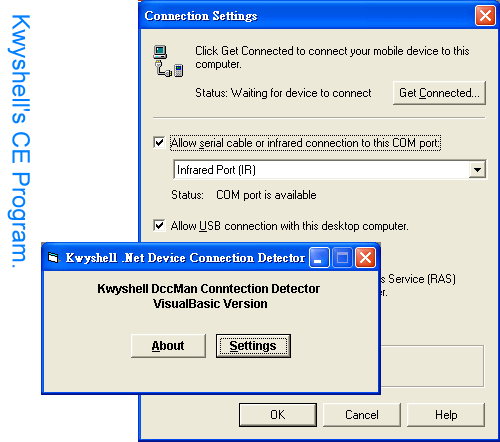



## Win CE Device Connection Detect II

### Description

The code is based on my article "Win CE Device Connection Detect". But someone may find it will be crashed for new version of ActiveSync. Thank Alber to remind me of this problem.   After a simple test of my code, I have found why the code does not work. Once again VB's old problem, crash for multi-thread issue. As what we knew, VB is not a thread safety language. In this case, ActiveSync in process-server change the calling context to different context from original. It caused VB's runtime library crashed. Why does VB always crash for multi-thread? You can compile your VB code and generate a PDB for your debugger like VS or VS.Net.Use debugger to trap the error and you will understand why crash crash everywhere. VB's runtime always assumes we just live in single thread.  

Another solution for this case is creating a COM server and passes the object reference to ActiveSync's COM Interface. VB supports STA thread model and all of object calls will be protected by STA. But this is not what a good solution for this case "A simple implementation".  My solution here is more complex but you don't have to create a COM server for your code. Since VB's code isn't thread-safety, we have to find it out and modify it. After observing the PDB behavior, we found following calls are not safe for MT. It's 'Any Win32 API code' and 'Most COM related VB-call'. Win32 API of VB's not safe. The problem is not caused by API but caused by VB's compiler adding some extra code (prolog/epilog) after each API calls (it's _VBASetSystemError and it's not safe).   We use ReplaceVTableEntry technique to do a wrapper by VB's Module. Because function of a module in VB is not belongs to any object and it will be called safely. After our wrap functions are called, we need to do something like synchronization and force original thread to deal our request here. What can we do any synchronization stuff without Win32 API functions and most object calls? Here I design a simple mechanism for VB's user. I just pass all of parameters to a buffer and deal this buffer by a continual time-loop. You can see the code and know what it's. The problem is that we just deal the parameters asynchronous and never cares about something like thread-safety for parameters processing.   But who cares!  http://home.kimo.com.tw/kwyshell/ http://kwyshekk.myweb.hinet.net/ 
 
### More Info
 

             |
---                |---
**Submitted On**   |2001-09-12 22:03:46
**By**             |[Kwyshell](https://github.com/Planet-Source-Code/PSCIndex/blob/master/ByAuthor/kwyshell.md)
**Level**          |Advanced
**User Rating**    |5.0 (10 globes from 2 users)
**Compatibility**  |VB 5\.0, VB 6\.0
**Category**       |[Windows CE](https://github.com/Planet-Source-Code/PSCIndex/blob/master/ByCategory/windows-ce__1-41.md)
**World**          |[Visual Basic](https://github.com/Planet-Source-Code/PSCIndex/blob/master/ByWorld/visual-basic.md)
**Archive File**   |[Win\_CE\_Dev1731864102004\.zip](https://github.com/Planet-Source-Code/kwyshell-win-ce-device-connection-detect-ii__1-53041/archive/master.zip)

